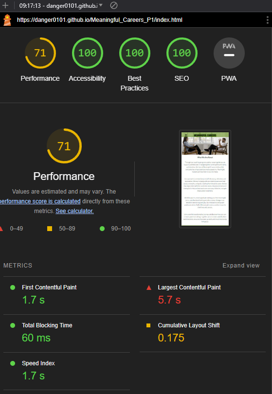
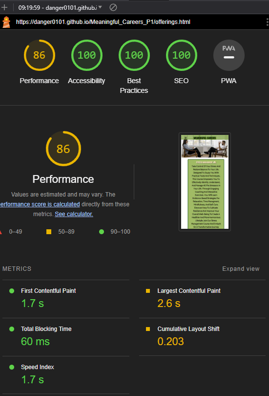
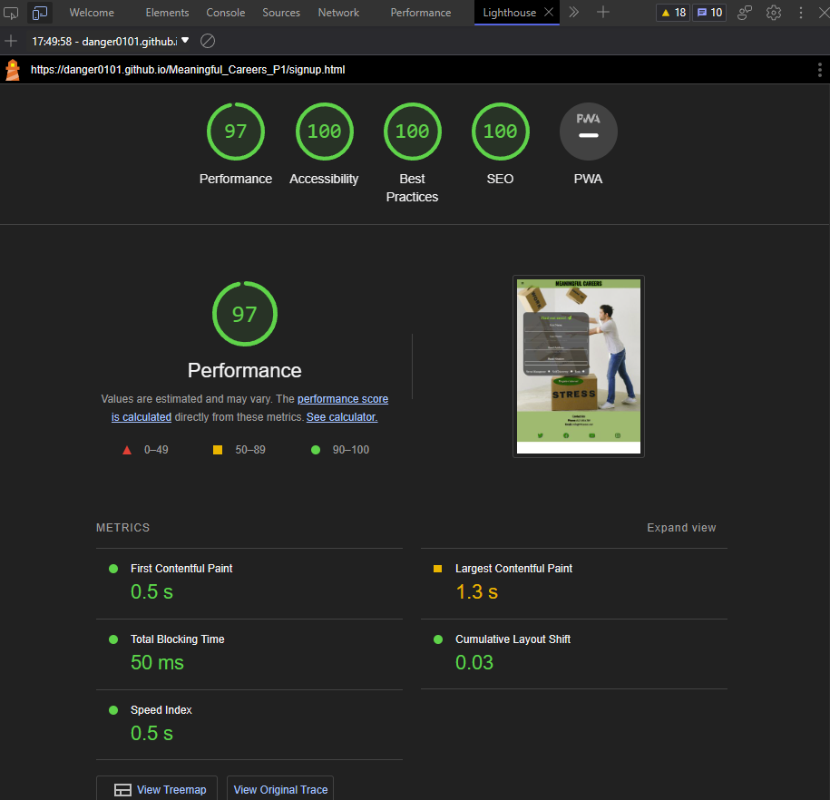
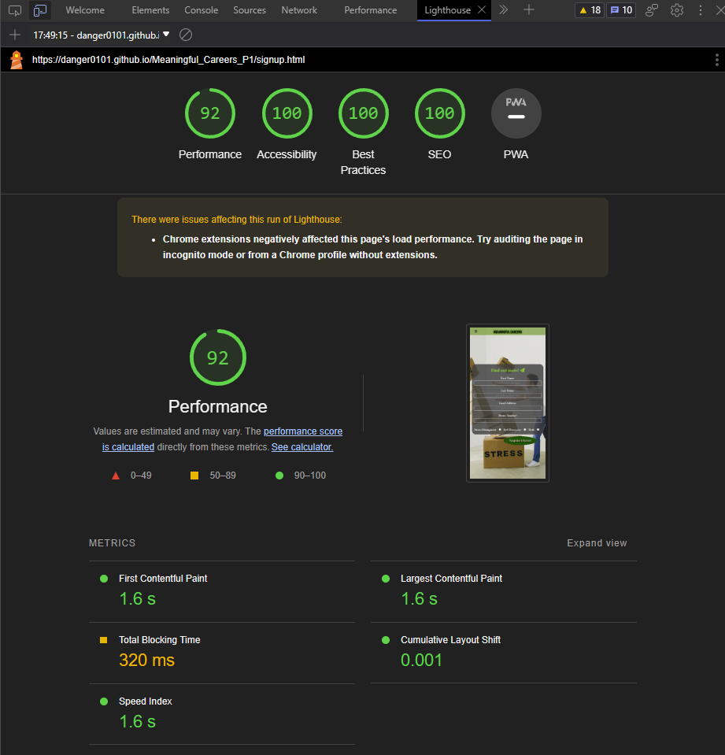

# Project Meaningful Careers Website

## Purpose and Value:

When I was coming up with the concept of this project I remembered back to when I almost started a coaching program of my own and well it sticks with me to this day. I wanted to build a site men and women, 18 to 30 years of age that can help them find the balance they need and deserve through a caterted coaching program. This site would involve two offers one on 'Stress Managment' as this is a skill that every one needs to be in a successful career and maintain a healthy work life balance. The other offer being 'Self Discovery' as knowing what your ture desires are in life is the biggest step forward towards making them a reality.

So what I wanted to bring was a way for those in the target of early to mid career a offering that can get them in the fast lane to ensureing their success and having a coach is a great way to do it and as my old mentor used to mention there is a reason most CEO's have regular meetings with a career, life, or  even bussiness coach. You need it to be and stay successful with out the burnout. So I wanted to bring something that triggers their desire to be the best they can. I feel while there is a long way to go if this idea where to come to life this is a great step forward in making them feel the way I would hope.

## The Development:

The site initially was only going to be 3 pages an index.html, signup.html, and reviews.html. I started building it in a seperate repository to this one around late May 2023 right after I finished learning HTML and CSS through Code Institute. I had to remake the repository as the main one I felt had way to large of a space between commits and I wasn't quite happy with that I felt it made it difficult to follow the changes. The reason between those commits was I was picking up 10-15 minute coding sessions between varrious other tasks in my daily work-life routine. I established the core of the page got it roughly to where I wanted it and looked at the commits and went this is unacceptable to my standards.

So I then went back to make the new repository and did my best to replicate the proccess of building the site to nearly identical to the original. So some commits may appear to be made in rapid succession this is due to the code already existing in the other repository and being brought over to the new one but in smaller incriments to do proper commits. Once that was completed I continued to make changes.

## What I would do diffrently in the future:

I would make this a fully functioning site including a fully funtioning form not just a page swap to say thanks while doing absolutly nothing. Do a more mobile first aproach whilst I did start that way I don't feel I did wnough. The page layouts could be simpler/flow better. After seeing some other works on reviews/testimonials I would like a more interactive version which you see one at a time and interact to view more. 

## Index.html:

### Chrome lighthouse desktop

### Chrome mobile lighthouse

Landing page for the site where a user first ends up and it allows them to get an understanding of what meaningful careers is about and what sort of value they might be able to obtain from it with out needing to go into lots of detail. Has a mission statement and about split into three scections.

## offerings.html

###Chrome lighthouse Desktop

###Chrome lighthouse mobile

This page is an information page about the two coaching offers provided by 'Meaningful Careers' and is meant to give a more indepth idea as to what each offer will provide them should the persue the coaching offer further.

## reviews.html

### Chrome lighthouse Desktop

### Chrome lighthouse mobile

A page to show case past experiances of those who have used the coaching offer and wished to leave a review. This adds more validity and makes the company more reputible to future prospects. As well as allow them to share in the success of others and see the changes its made.

## signup.html

### Chrome lighthouse Desktop

### Chrome lighthouse mobile

For those who feel the desire to proceed further into geting a coaching session we have a signup page. Theoretically this is where the magic starts to happen. A user would input all the information on this page and register their interest and this will go to a database and pop up to one of the coachs to give the prospect a call or email. With more information about the coaching offer of their choosing. This is where the coach will walk them through the offering and pitch them on it in a way that works for them.

## thankyou.html

This is the landing page after a user submits their form idealy once javascript would be added this would change a good bit from this state I would like it to propegate a more personalized messge to the user and provide them an estimate time till they can recieve the call or a link to book a call.

## Navigation

The navigation is an animated hamburger icon from fontawesome using css logic on a hident check box when checked it opens and animates the dropdown menu. To keep it simple and uniform it remains the same at all page sizes and even on all pages it never changes so you can find what your looking for with ease.

## References
Photo by cottonbro studio: https://www.pexels.com/photo/person-in-black-pants-and-black-shoes-sitting-on-brown-wooden-chair-4101143/

Photo by Pixabay: https://www.pexels.com/photo/close-up-of-human-hand-327540/

Photo by Sindre Fs: https://www.pexels.com/photo/man-wearing-white-crew-neck-vans-top-and-blue-denim-button-up-jacket-1040881/

Photo by Andrea Piacquadio: https://www.pexels.com/photo/man-in-black-suit-holding-leather-briefcase-3778212/

Photo by Rodolfo Clix: https://www.pexels.com/photo/silhouette-image-of-person-praying-1615776/

Photo by SHVETS production: https://www.pexels.com/photo/man-falling-carton-boxes-with-negative-words-7203956/

W3Schools for insperation and building knowledge on subjects covered in course also went to look at it any time I wanted to figure out what a CSS code did. Allowed me to vastly expand what I was able to do with the site although all code was hand written.

Code Institute 'Love Running' Project for form inspiration I took the basic layout of what I had to do in the challenge and applied it to this project.