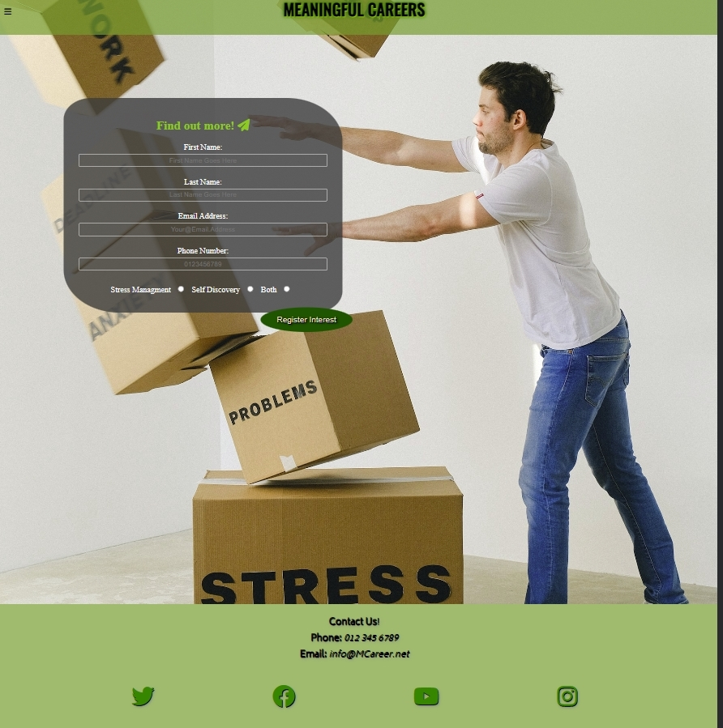
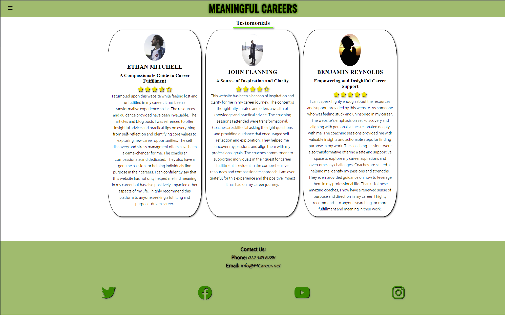
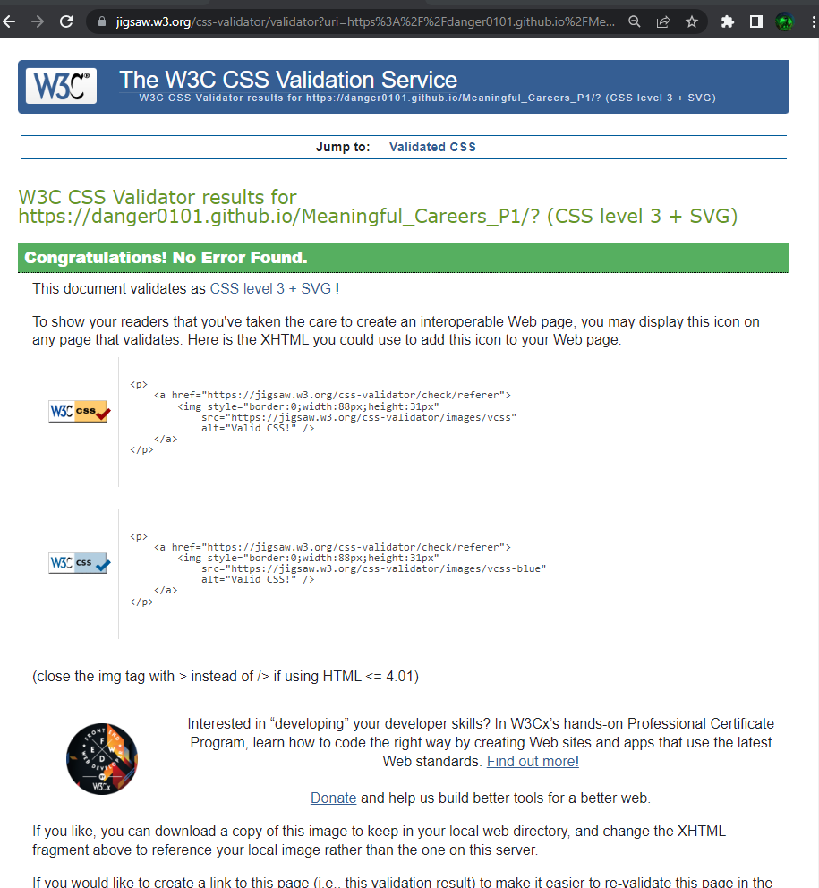
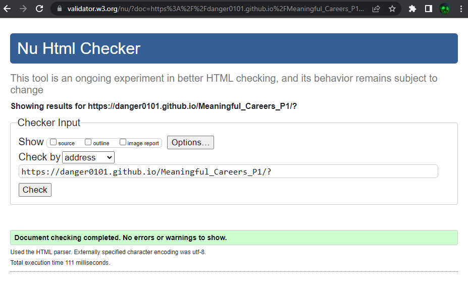
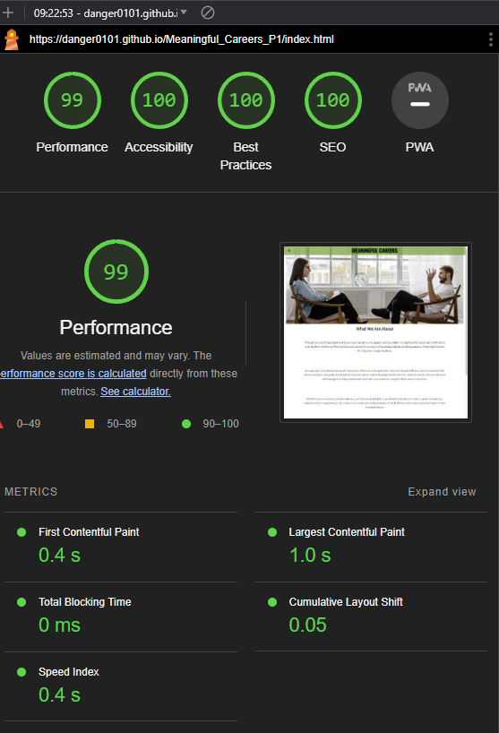
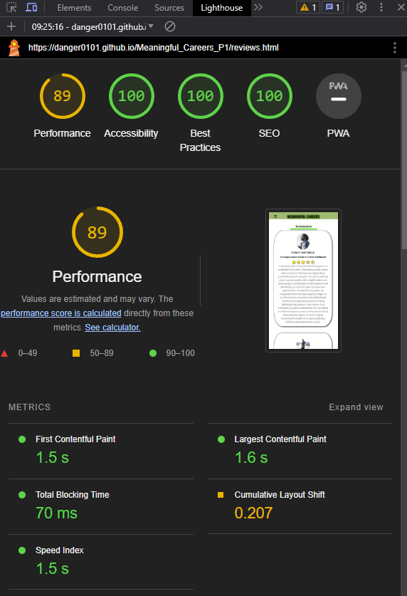

# Meaningful Careers
Meaningful Careers allows people to learn about the company and and its offerings while providing those interested in perssuing more information by registering their interest and allowing a representative to reach out to them to provide more information and to see how Meaningful Careers can best suit their needs.

---
## User Stories
- As a first time visitor, I want to understand the website and get to know what its all about.
- As a first time visitor, I want to be able to navigate around the webpage's with ease and find what I am looking for quickly.
- As a first time visitor, I want to see some reviews or testimonials to understand the value I can achieve from the website.
- As a user, I want to have a form I can fillout to recieve more information on the offerings.
- As a user, I want to be able to get in contact with Meaningful Careers on my own time.
- As a user, I want to be directed to a page once I register interest to show its worked.
- As a mobile user, I want the website to be responsive and leggible on my devices.
- As a desktop user, I want the information to be readable and not streched out across the page.

## Features
### Navbar

- The navigation is an animated hamburger icon from fontawesome using css logic on a hident check box when checked it opens and animates the dropdown menu. To keep it simple and uniform it remains the same at all page sizes and even on all pages it never changes so you can find what your looking for with ease.

---
### hero image
- provides a looking glass into the feel of profesionalism provided by Meaningful careers coaching programs.

---
### footer
- Provides contact information for Meaningful Careers
- Has links to the relavent social media accounts

---
### index.html

- Landing page for the site where a user first ends up and it allows them to get an understanding of what meaningful careers is about and what sort of value they might be able to obtain from it with out needing to go into lots of detail. Has a mission statement and about split into three scections.

---
### offerings.html

- This page is an information page about the two coaching offers provided by 'Meaningful Careers' and is meant to give a more indepth idea as to what each offer will provide them should the persue the coaching offer further.

---
### signup.html

- For those who feel the desire to proceed further into geting a coaching session we have a signup page. Theoretically this is where the magic starts to happen. A user would input all the information on this page and register their interest and this will go to a database and pop up to one of the coachs to give the prospect a call or email. With more information about the coaching offer of their choosing. This is where the coach will walk them through the offering and pitch them on it in a way that works for them.

---
### reviews.html

- A page to show case past experiances of those who have used the coaching offer and wished to leave a review. This adds more validity and makes the company more reputible to future prospects. As well as allow them to share in the success of others and see the changes its made.

---
### thankyou.html

- This is the landing page after a user submits their form idealy once javascript would be added this would change a good bit from this state I would like it to propegate a more personalized messge to the user and provide them an estimate time till they can recieve the call or a link to book a call.

## Testing
### How I tested
- Google Chrome (various resolutions)
- Samsung A41 Phone
- Tablet

### bugs encountered
- Hero Image not being responsive in a good way was zooming in weird and making the image basically a tiny fraction of the window. Went through a few diffrent varriations of this and wiht the help of my mentor figured out the best solution and I really love how it turned out.
- A few typos and duplicate enteries in the CSS code which was an easy fix as just needed to correct typos and combine the enteries
- Accidentally deleted a body tag on index.html
- Whilst learning the mark up in readme 

## Validation testing
### CSS
-checked with [W3 CSS Validator](https://jigsaw.w3.org/css-validator/) completed with no issues found.

### HTML
- checked with [W3 HTML Validator](https://validator.w3.org/) on all pages with no errors or warnings.

### Contrast
- Checked all pages with [A11Y contrast checker](https://color.a11y.com/) Cameback with no issues.

### index.html
**Chrome lighthouse desktop**

**Chrome mobile lighthouse**

### offerings.html
**Chrome lighthouse Desktop**

**Chrome lighthouse mobile**

### reviews.html
**Chrome lighthouse Desktop**

**Chrome lighthouse mobile**

### signup.html
**Chrome lighthouse Desktop**

**Chrome lighthouse mobile**

## Deployment
Used github pages [View Site here](https://danger0101.github.io/Meaningful_Careers_P1/?)

## Technology used
- HTML
- CSS
- Fontawesome
- Google Fonts
- Visual Studios Code (VSCode)
- Github
- Hypervisor
- Git
- Gyzo
- MS Paint
- Gimp version 2.10.22
- Github Desktop App

## Wireframes
### index.html

### reviews.html

### offerings.html

### signup.html

### thankyou.html

## Credits
** Images **
- [Photo by cottonbro studio:](https://www.pexels.com/photo/person-in-black-pants-and-black-shoes-sitting-on-brown-wooden-chair-4101143/)

- [Photo by Pixabay:](https://www.pexels.com/photo/close-up-of-human-hand-327540/)

- [Photo by Sindre Fs:](https://www.pexels.com/photo/man-wearing-white-crew-neck-vans-top-and-blue-denim-button-up-jacket-1040881/)

- [Photo by Andrea Piacquadio:](https://www.pexels.com/photo/man-in-black-suit-holding-leather-briefcase-3778212/)

- [Photo by Rodolfo Clix:](https://www.pexels.com/photo/silhouette-image-of-person-praying-1615776/)

- [Photo by SHVETS production:](https://www.pexels.com/photo/man-falling-carton-boxes-with-negative-words-7203956/)

**Code related**
- [dcode](https://www.youtube.com/watch?v=mntgaH5x-GQ&t=95s) for how to add a colored navigation bar.

- W3Schools for insperation and building knowledge on subjects covered in course also went to look at it any time I wanted to figure out what a CSS code did. Allowed me to vastly expand what I was able to do with the site although all code was hand written after initial Code instute templete.

- Code Institute 'Love Running' Project for form inspiration I took the basic layout of what I had to do in the challenge and applied it to this project.

- Mentor Aleksei Konovalov: (github - https://github.com/lexach91) Gave me tips and support when needed helped me solve a few issues with heroimage, favicon, And some pointers and better responsiveness at higher resolutions. (above standard users 1080p)

- My wife whos been supper supportive of this change in career for me and just being out right amazing we will get her into this one way or another I am sure.

- Code Institute for providing an excelent accelerated learning platform worth every penny.
---
## Future feature ideas
- *Leave A Review* - where users can leave a review and it is added to site automatically.
- *Automated Email* - Send out an automated email after registering interest letting the user know when to expect contact from a coach. Include some resources in the mean time.
- *Fully Functioning Form* - Add user data to a a secure data base which will allocate to coaches to contact.
- *User Account Login and member pages* - A member area possibly a way of communicating with coaches and a schedule meeting feature ect.
- *Funnel* - Possibly if deemed benificial a funnel system that incrimentally provides more user information and possible upsells.